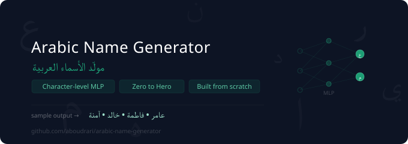

(https://github.com/user-attachments/files/30428238/README.1.md)
<p align="center">
  
</p>

<p align="center">
  
  
  
  
  
</p>

---

A **character-level MLP** that learns to generate Arabic names — built completely from scratch using Python, NumPy, and PyTorch. No high-level wrappers. No copy-pasting from tutorials. Every embedding, every gradient, by hand.

Inspired by [Andrej Karpathy's makemore series](https://www.youtube.com/playlist?list=PLAqhIrjkxbuWI23v9cThsA9GvCAUhRvKZ).

---

## What it does

Given a training set of 207 real Arabic names (عامر، فاطمة، خالد...), the model learns the statistical patterns of Arabic character sequences and generates new names that look and sound authentically Arabic.

```
Input:  [., ., ع]  →  Model  →  Output: ا
Input:  [., ع, ا]  →  Model  →  Output: م
Input:  [ع, ا, م]  →  Model  →  Output: ر
Generated name: عامر ✓
```

---

## How it works

The model is a simple 3-layer MLP:

1. **Embedding** — each character is mapped to a dense vector of size `d`
2. **Hidden layer** — linear transformation + BatchNorm + Tanh activation
3. **Output layer** — projects to vocabulary size, softmax gives character probabilities
4. **Training** — negative log-likelihood loss, mini-batch gradient descent

No transformers. No attention. Just the fundamentals — and that's the point.

---

## Tech stack

| Tool | Purpose |
|------|---------|
| Python 3.10+ | Core language |
| NumPy | Linear algebra |
| PyTorch | Tensors and autograd |
| Pandas | Data loading and cleaning |
| Matplotlib | Loss curves and activation histograms |
| Jupyter | Interactive notebooks |

---

## Project structure

```
arabic-name-generator/
│
├── data/
│   └── arabic_names.csv            # 207 unique Arabic names
│
├── notebooks/
│   └── arabic_name_generator.ipynb # Full pipeline — data to sampling
│
├── assets/
│   └── banner.svg                  # Project banner
│
├── README.md
└── .gitignore
```

---

## Roadmap

- [x] Phase 1 — Data loading and cleaning (207 unique names)
- [ ] Phase 2 — Vocabulary: character-to-integer mappings
- [ ] Phase 3 — Dataset: build (X, Y) training pairs with context window
- [ ] Phase 4 — Model: Embedding + Hidden layer + BatchNorm
- [ ] Phase 5 — Training loop: forward pass → loss → backward → update
- [ ] Phase 6 — Sampling: generate new Arabic names from the model

---

## Getting started

```bash
git clone https://github.com/aboudrari/arabic-name-generator.git
cd arabic-name-generator
pip install numpy pandas matplotlib torch jupyter
```

Then open `notebooks/arabic_name_generator.ipynb` in VS Code or Jupyter.

---

## Why Arabic names?

Most character-level language model tutorials use English names or Shakespeare. Arabic is more interesting — a 28-letter alphabet, right-to-left script, rich morphology, and almost no existing implementations at this level. It's a harder and more meaningful challenge.

---

## Inspiration

This project is my hands-on implementation of the concepts from Karpathy's makemore series, applied to Arabic instead of English. Built as part of my AI Engineering portfolio targeting funded master's programs in Germany (relAI / SECAI — 2027).

---

<p align="center">
  Made by <a href="https://github.com/aboudrari">Abdallah Aboudrari</a> — AI Engineering Student @ Cyprus International University
</p>
